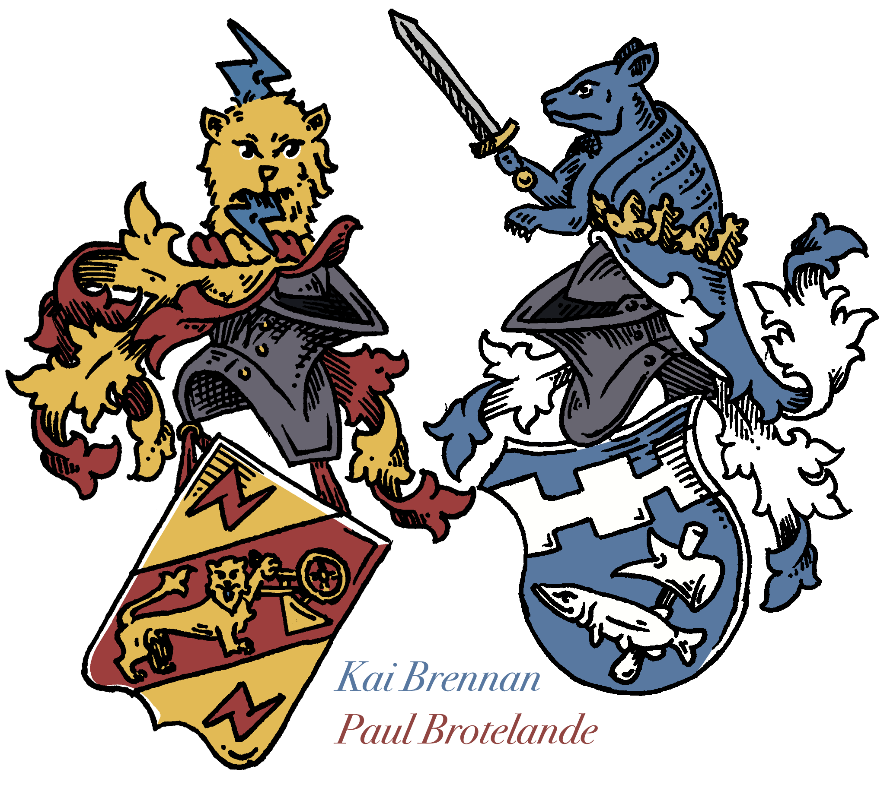

# Automated Historical Record Transcription (AHRT)

AHRT is a machine learning-based tool designed to automate the transcription of historical "ten-year tables" (tables décennales, tienjarige tafels) from 19th and early 20th century France and Belgium. The project aims to reduce transcription labor for genealogists, archivists, and researchers by creating an efficient and accessible method for indexing names, dates, and event types in historical records.

## Features
- **Optical Character Recognition (OCR):** Specialized model tailored for French and Belgian handwriting styles (Écriture Anglaise).
- **Image Segmentation:** Automated preprocessing and segmentation for various handwritten and printed formats.
- **Transfer Learning:** Adapted model to recognize regional and linguistic variations in historical records.
- **Edge Device Implementation:** (In Progress) Deployment on a Xilinx KRIA KV-260 board for accessible use in archives.
- **Searchable Databases:** Direct pipeline for generating organized CSV files from historical index entries.

## Background
Historical records are often inaccessible due to their handwritten nature and regional variations. By focusing on indices of names and events, AHRT enables faster data retrieval, especially for genealogical and sociological research.

This project leverages transfer learning and custom datasets to enhance existing OCR capabilities, particularly for Francophonic records. Our model outperforms baseline models and general-purpose OCRs in recognizing antiquated handwriting styles and specialized content.

## Results
- Training loss: **0.3607**
- Validation loss (lowest): **2.26**
- Significant improvement in transcription accuracy compared to general-purpose OCR tools.

For more details, see the [paper](./dated_related/'Machine Learning for Automated Historical Record Transcription on Edge Devices.pdf').

## Setup

### Prerequisites
- Python 3.9 or higher
- TensorFlow or PyTorch (specify version)
- OpenCV
- NumPy, Pandas, and other dependencies

### Installation
1. Clone the repository:
   ```bash
   git clone https://github.com/your-repo/ahrt.git
   cd ahrt
   ```

### Dataset
The training dataset includes segmented and labeled examples of ten-year tables from seven regions in France and Belgium. To use the model with your data:
1. Format your data as grayscale images with clear segmentation.
2. Update the dataset in `data.json`.

## Contributing
Contributions are welcome! To contribute:
1. Fork the repository.
2. Create a feature branch (`git checkout -b feature-branch`).
3. Commit changes (`git commit -m 'Add feature'`).
4. Push to the branch (`git push origin feature-branch`).
5. Open a pull request.

## Future Work
- Complete the deployment on edge devices (KRIA KV-260).
- Expand datasets to include other regions and languages.
- Improve segmentation algorithms for higher accuracy.

## License
This project is licensed under the [MIT License](LICENSE).

## Contact
For questions or feedback, contact:
- Kai Brennan (kai.j.brennan@gmail.com)
- Paul Brotelande (pbrotelande@gmail.com)



